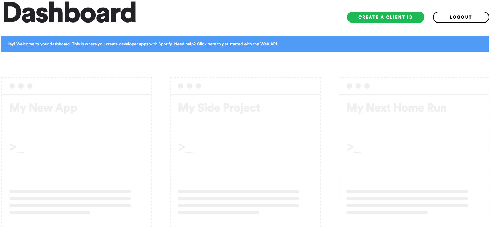
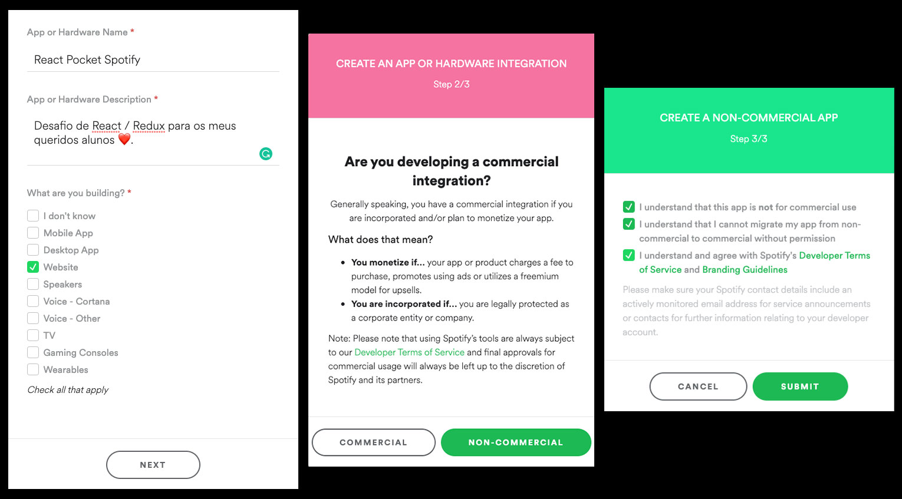
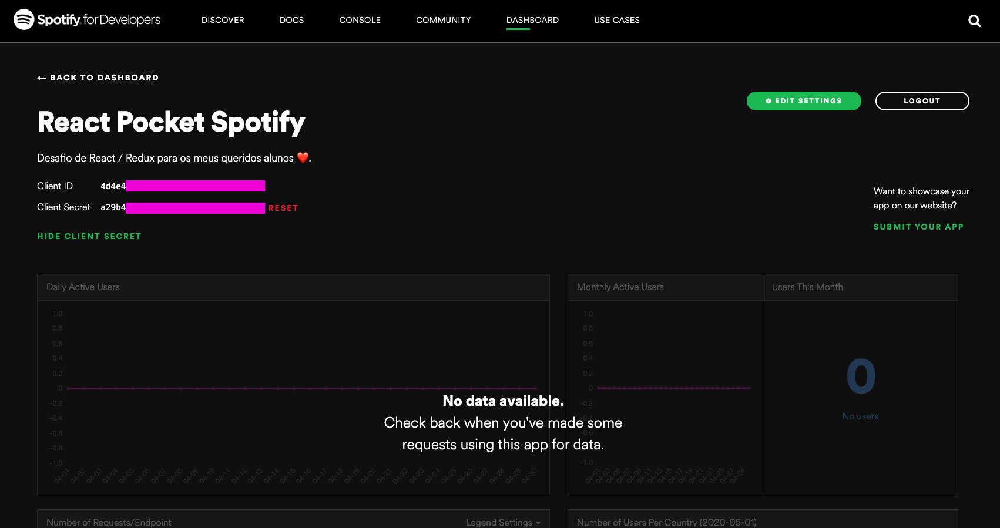
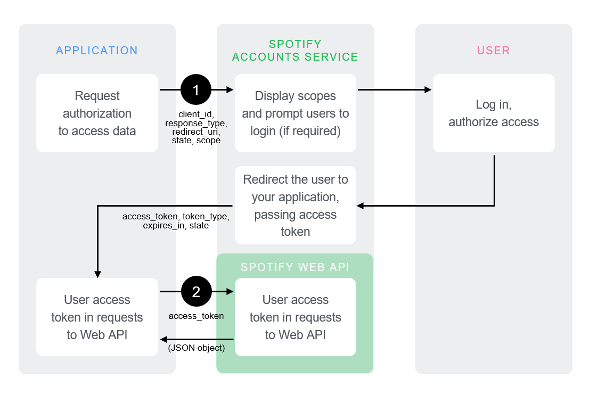
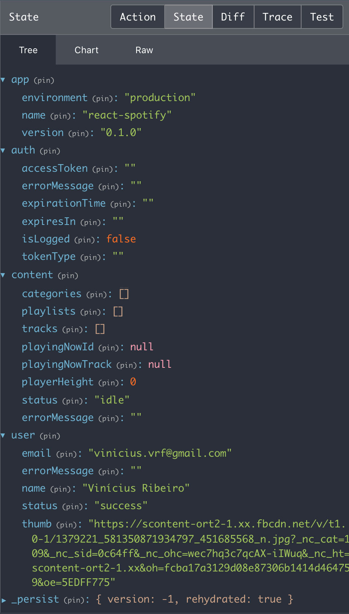

# React / Redux Spotify Pocket SPA

[](https://app.netlify.com/sites/viniciusvinna-react-pocket-spotify/deploys)
## Objetivo:
Neste último desafio você aplicará todo o conhecimento adquirido durante o curso e terá que desenvolver uma versão _**pocket**_ do Spotify, integrada a [Web API](https://developer.spotify.com/documentation/web-api) oficial, utilizando `fluxo implícito de concessão` (Implicit Grant Flow) para realizar a autenticação do usuário, permite que ele acesse rotas privadas dentro da aplicação.

## Referência do projeto finalizado e em ambiente de produção:
 [https://viniciusvinna-react-pocket-spotify.netlify.app](https://viniciusvinna-react-pocket-spotify.netlify.app)


## Código Fonte:
Caso precise consultar o código fonte original para tirar dúvidas, você poderá acessar:
>  [https://github.com/ViniciusVinna/react-spotify-pocket](https://github.com/ViniciusVinna/react-spotify-pocket)

## Tópicos:
Neste desafio você vai praticar os seus conhecimentos em:

* Fetch API
* JS Funcional: `Map`, `Filter`
* Modularização: `BEM` (Bloco, Elemento e Modificador)
* Presentational e Container Components
* Rails-Style Structure
* React Hooks, `useState`, `useEffect`, `useRef`
* React Testing Library
* React
* React Router Dom
* Rotas Privadas
* Redux: `ActionTypes`, `Action Creators`, `Reducers`, `Store`
* Redux Persist: `LocalStorage`

## Critérios de Aceite:
- [x] Ser desenvolvido utilizando abordagem funcional com React Hooks.
- [x] A aplicação deve possuir controle de **estado global** controlado pelo `Redux`.
- [x] Consumir os dados do `Spotify Web API`, utilizando o `Fetch API` do Javascript e apenas o método `GET` nas requisições.
- [x] Atenticação deve utilizar o fluxo `Implicit Grant Flow` da documentação ofial.
- [x] **Rotas privadas** devem redirecionar o usuário para a tela de login, caso o token de autenticação tenha expirado.
- [x] A rota privada `/dashboard` deverá exibir a lista de categorias da `Spotify Web API`.
- [x] A rota privada `/dashboard/{categoria_id}` deverá exibir a lista de **playlists** da categoria selecionada.
- [x] A rota privada `/dashboard/{categoria_id}/{playlist_id}` deverá exibir a lista de **faixas** da playlist selecionada.
- [x] O usuário deverá ser capaz de reproduzir as faixas ao clicar em cada uma delas.
- [x] A faixa deve **continuar tocando** enquanto o **usuário navega por outras rotas**, clicando no botão `voltar do navegador` ou da `interface de usuário`.
- [x] O player deve possuir os controles de `Play` e `Pause`.
- [x] Quando a **música acabar** o player deverá **desaparecer** da UI.

## Sobre o Spotify Web API:
Antes de começar a desenvolver o projeto, primeiro você precisará criar uma conta de desenvolver no Spotify e registrar seu aplicativo:
#### 1) Criar uma conta no Spotify
> Para utilizar a Web API, é necessário que você tenha uma conta de usuário (premium ou gratuita).
> Crie uma conta gratuita em [www.spotify.com](www.spotify.com).
> Após criar a conta, acesse a página `Dashboard` [https://developer.spotify.com/dashboard](https://developer.spotify.com/dashboard).
>
> 

#### 2) Registrar o Aplicativo
> Registre seu APP sem fins comerciais:

> Após concluir o registro você será redirecionado(a) para página de analytics do `React Pocket Spotify` onde serão revelados os tokens  `Client ID` e `Client Secret`. Você precisará apenas do ClientID para realizar as requisições do Spotify Web API.
>
>

## Fluxo de autenticação
> Nesse projeto vamos utilizar o fluxo implícito de concessão é para `clientes` implementados inteiramente usando JavaScript e em execução no navegador do proprietário do recurso.
>
>
> Leia mais na seção `Implicit Grant Flow` em [https://developer.spotify.com/documentation/general/guides/authorization-guide](https://developer.spotify.com/documentation/general/guides/authorization-guide)

## Endpoints
* Documentação oficial: [https://developer.spotify.com/documentation/web-api/reference](https://developer.spotify.com/documentation/web-api/reference)

#### Coleções utilizadas
> * [Get User's Profile](https://developer.spotify.com/documentation/web-api/reference/users-profile/get-current-users-profile/)
> * [Get a List of Categories](https://developer.spotify.com/documentation/web-api/reference/browse/get-list-categories/)
> * [Get a Category's Playlists](https://developer.spotify.com/documentation/web-api/reference/browse/get-categorys-playlists/)
> * [Get a Playlist's Items](https://developer.spotify.com/documentation/web-api/reference/playlists/get-playlists-tracks/)

## Estrutura de arquivos e pastas
> A estrutura de pastas utilizada é conhecida como `Rails-Style Structure (function-first organization)` com um arquivo index por pasta de _feature_ levemente inspirada no [Destiny: Prettier for File Structures](https://github.com/benawad/destiny):

```bash
.
├── actions
│   ├── auth.js
│   ├── content.js
│   ├── index.js
│   └── user.js
├── assets
│   ├── icons
│   │   ├── spotify-icon-green.svg
│   │   └── spotify-icon-white.svg
│   ├── images
│   │   ├── app-intro-1.jpg
│   │   └── app-intro-2.jpg
│   └── logos
│       ├── spotify-logo-green.svg
│       └── spotify-logo-white.svg
├── components
│   ├── Loading
│   │   ├── Loading.jsx
│   │   └── Loading.scss
│   ├── Logo
│   │   └── Logo.jsx
│   ├── RouteHeader
│   │   ├── RouteHeader.jsx
│   │   └── RouteHeader.scss
│   ├── WelcomeBox
│   │   ├── WelcomeBox.jsx
│   │   └── WelcomeBox.scss
│   └── index.jsx
├── config
│   └── index.js
├── constants
│   ├── auth.js
│   ├── content.js
│   └── user.js
├── containers
│   ├── App
│   │   ├── App.jsx
│   │   └── App.scss
│   ├── Authorize
│   │   ├── Authorize.jsx
│   │   └── Authorize.scss
│   ├── Categories
│   │   ├── Categories.jsx
│   │   ├── Categories.scss
│   │   └── CategoryItem.jsx
│   ├── Dashboard
│   │   ├── Dashboard.jsx
│   │   └── Dashboard.scss
│   ├── Login
│   │   ├── Login.jsx
│   │   └── Login.scss
│   ├── Player
│   │   ├── Player.jsx
│   │   └── Player.scss
│   ├── Playlists
│   │   ├── PlaylistItem.jsx
│   │   ├── Playlists.jsx
│   │   └── Playlists.scss
│   ├── PrivateRoute
│   │   └── PrivateRoute.jsx
│   ├── Topbar
│   │   ├── Topbar.jsx
│   │   └── Topbar.scss
│   ├── Tracks
│   │   ├── Track.jsx
│   │   ├── Track.scss
│   │   ├── Tracks.jsx
│   │   └── Tracks.scss
│   └── index.jsx
├── index.js
├── modules
│   ├── custom-hooks.js
│   ├── endpoints.js
│   ├── helpers.js
│   ├── request.js
│   └── url.js
├── reducers
│   ├── app.js
│   ├── auth.js
│   ├── content.js
│   ├── index.js
│   └── user.js
├── routes
│   ├── AuthorizeRoute.jsx
│   ├── DashboardRoute.jsx
│   ├── LoginRoute.jsx
│   ├── PlaylistsRoute.jsx
│   ├── TracksRoute.jsx
│   └── index.jsx
├── serviceWorker.js
├── setupTests.js
├── store
│   └── index.js
└── styles
    ├── globalStyles.scss
    ├── normalize.scss
    └── reset.scss
```

## ‼️ Atributos `data-testid` Obrigatórios:
Para que seu teste seja avaliado corretamente na plataforma é necessário que os `Componentes` e `Contêineres` tenham tenham os atributos `data-testid` atribuídos aos seguintes componentes

```bash
.
├── components
│   ├── Loading
│   │   └── Loading.jsx ➡️ data-testid="loading"
│   ├── Logo
│   │   └── Logo.jsx ➡️ data-testid="logo"
│   ├── RouteHeader
│   │   └── RouteHeader.jsx ➡️ data-testid="route-header"
│   └── WelcomeBox
│       └── WelcomeBox.jsx ➡️ data-testid="welcome-box"
└── containers
    ├── App
    │   └── App.jsx ➡️ data-testid="app"
    ├── Authorize
    │   └── Authorize.jsx ➡️ data-testid="callback"
    ├── Categories
    │   ├── Categories.jsx ➡️ data-testid="categories"
    │   └── CategoryItem.jsx ➡️ data-testid="category"
    ├── Dashboard
    │   └── Dashboard.jsx ➡️ data-testid="dashboard"
    ├── Login
    │   └── Login.jsx ➡️ data-testid="login"
    ├── Player
    │   └── Player.jsx ➡️ data-testid="player"
    ├── Playlists
    │   ├── PlaylistItem.jsx ➡️ data-testid="playlist"
    │   └── Playlists.jsx ➡️ data-testid="playlists"
    ├── Topbar
    │   └── Topbar.jsx ➡️ data-testid="topbar"
    └── Tracks
        ├── Track.jsx ➡️ data-testid="track"
        └── Tracks.jsx ➡️ data-testid="tracks"
```

## Estado Inicial da Store
> >

## Dependências Necessárias
```json
{
    "lodash": "^4.17.15",
    "node-sass": "^4.14.0",
    "prop-types": "^15.7.2",
    "react-icons": "^3.10.0",
    "react-ink": "^6.4.0",
    "react-redux": "^7.2.0",
    "react-router-dom": "^5.1.2",
    "redux": "^4.0.5",
    "redux-persist": "^6.0.0"
}
```
Você pode instalar todas as dependências necessárias através utilizando o Yarn ou NPM:
* **Yarn** ▶️ `yarn add lodash node-sass prop-types react-icons react-ink react-redux react-router-dom redux redux-persist`
* **NPM** ▶️ `npm install --save lodash node-sass prop-types react-icons react-ink react-redux react-router-dom redux redux-persist`

## Requisitos:
* **[Node v13.8.0](https://nodejs.org/en/)** - ou superior, instalado em seu computador.
* **[Create React App](https://github.com/facebook/create-react-app)**
